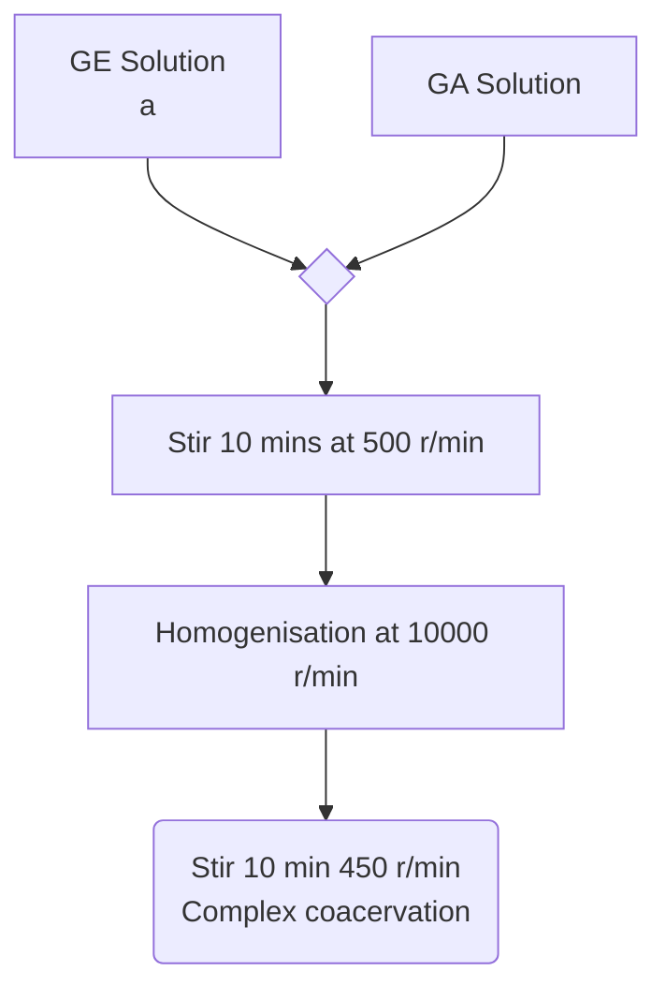

```mermaid
graph TB
        A[GE Solution<br>a]-->C{ }
        B[GA Solution]-->C{ } 
        C{ }-->D[Stir 10 mins at 500 r/min]
        D[Stir 10 mins at 500 r/min]-->E[Homogenisation at 10000 r/min]
        E[Homogenisation at 10000 r/min]-->F(Stir 10 min 450 r/min <br> Complex  coacervation)
```
